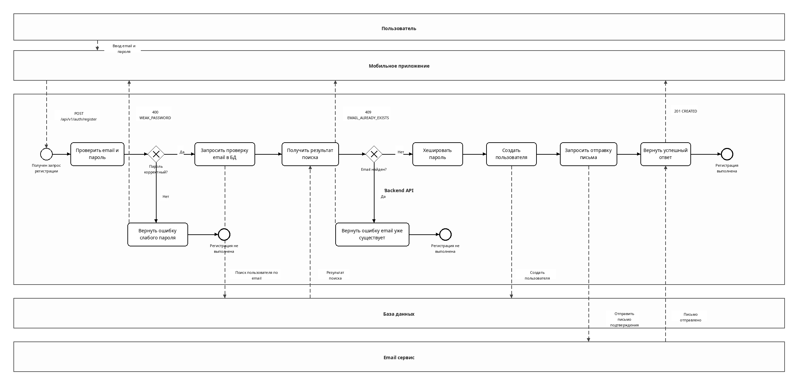
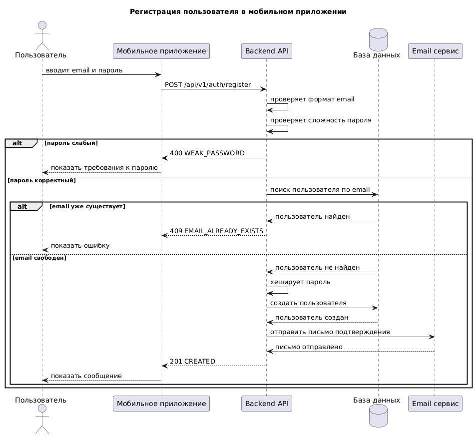

# Регистрация и аутентификация в мобильном приложении интернет-магазина

## Описание

Проект содержит материалы тестового задания по проектированию процесса регистрации и аутентификации пользователя в мобильном приложении интернет-магазина.

Рассмотрены сценарии:

- регистрация по email и паролю
- обработка ошибки email уже существует
- обработка ошибки слабый пароль
- отправка письма подтверждения
- вход через Google и Apple на уровне функциональных требований
- восстановление пароля

## Диаграммы

### BPMN диаграмма регистрации

Исходный файл:

[registration.bpmn](diagrams/registration.bpmn)

### UML Sequence Diagram

Исходный файл:

[sequence.puml](diagrams/sequence.puml)

## Документы

- [Функциональные и нефункциональные требования](requirements.md)
- [Acceptance Criteria](acceptance-criteria.md)
